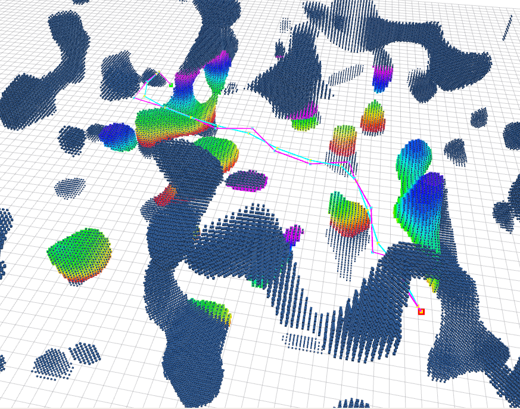

# RRT* ON POINTCLOUD FOR ROS
Development of RRT* on ROS using `sensor_msgs::PointCloud2` received MOCKAMAP by HKUST (https://github.com/HKUST-Aerial-Robotics/mockamap) from developed on ROS

```cpp
// Solution found! with 270 iter and 23 nodes
// Total Time Taken = 1.297857s!
```


### Current Params for RRT
These are the current parameters for tuning the RRT, sometimes the search does not give a good result if the **boundaries are too small** and the **threshold is too large**.
The current working parameters are as shown below
```cpp
string _file_location;
double _step_size = 3.0; //Size for adding the next node
double _obs_threshold = 1.7; //Threshold to void the use for the node
double _random_multiplier = 1.0; //When initiating the start and end point, the points may lie on a pointcloud
int _line_search_division = 3; //Splitting the line search to these number of divisions
double _xybuffer = 3.0; //Size for xy buffer
double _zbuffer = 5.0; //Size for z buffer
double _start_delay = 1.0; //Delay before starting
```

### Simple Setup
```
cd
mkdir -p rrt_ws/src
cd rrt_ws/src
git clone https://github.com/matthewoots/rrtstar_pc_ros.git --recurse-submodules
cd ..
catkin build
```
### Launch
```
# To show everything even the map and the algorithm and the path
rrt_rviz.launch

# To show mockamap in rviz only
mockamap_rviz.launch
```

### References 
1. **RRT** : https://github.com/swadhagupta/RRT/blob/master/rrt.cpp or https://2020.robotix.in/tutorial/pathplanning/rrtplanner/
2. **Mockamap** : https://github.com/HKUST-Aerial-Robotics/mockamap
3. **PCL Box filter** : https://stackoverflow.com/questions/45790828/remove-points-outside-defined-3d-box-inside-pcl-visualizer/45793962
4. **PCL Callbacks** : https://answers.ros.org/question/282259/ros-class-with-callback-methods/