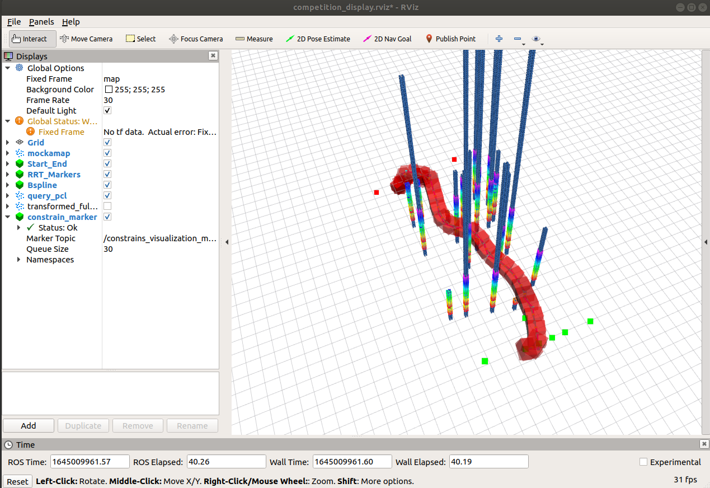

# RRT* ON POINTCLOUD FOR ROS
Development of RRT* on ROS using `sensor_msgs::PointCloud2` received from `mockamap` by **HKUST** (https://github.com/HKUST-Aerial-Robotics/mockamap)

Using custom generalized `Bspline` used in https://github.com/matthewoots/px4-path-planner to generate a b-spline path within the RRT

Will be integrated into https://github.com/matthewoots/px4-path-planner for global swarm planning operation with PX4

```cpp
// Actual obstacle size 57312! 
// After Crop : Obstacle size 14041! 

// RRT Segment
// Solution found! with 96 iter and 13 nodes
// Total Time Taken = 0.072487!
// RRT node size = 10

// Bounding Box Search 
// With 33 points of query 
// [lbfgs_pcl_constrain.h] Total time 0.347703

// Will be much faster with lower density pointcloud, this is considering internal fill of the mockamap
```
|Without Bounding Box|With Bounding Box|
|---|---|
|||


### Current Params for RRT
These are the current parameters for tuning the RRT, sometimes the search does not give a good result if the **boundaries are too small** and the **threshold is too large**.
The current working parameters are as shown below
```yaml
string _file_location change in launch
The rest of the parameters change in yaml
# RRT Parameters
start_delay: 3.0 # Represents the time for mockamap to startup
step_size: 1.5 # Represents node step size when doing RRT
obs_threshold: 0.9 # Acceptable distance from the threshold
random_multiplier: 1.0 # Random multiplier to push start and end points out of obstacles
line_search_division: 4 # Split the line search portion for any collision

xybuffer: 4.0 # XY buffer for cropping of pointcloud
zbuffer: 4.0 # Z buffer for cropping of pointcloud 
passage_size: 4.5 # In this case it is a Y buffer, since its suppose to be align to X

min_height: 1.0 # Minimum height (will clamp)
max_height: 5.0 # Maximum height (will clamp)

## Bspline Parameters
bs_order: 6

## Box Constrain Parameters
max_boundaries: 0.7 # Bounding box maximum constrain
corridor_size: 0.6 # This affect cropping about the Y
division: 4 # Same as the line search for collision
safety_radius: 0.5 # Safety radius of the agent
```

### Simple Setup
```
cd
mkdir -p rrt_ws/src
cd rrt_ws/src
git clone https://github.com/matthewoots/rrtstar_pc_ros.git --recurse-submodules
cd ..
catkin build -j1 #or else ros_message will not be build properly
```
### Launch
```
# To show everything even the map and the algorithm and the path with bounding box
rrt_rviz.launch

# To show visualization in the competition field with bounding box
competition_rviz.launch

# To show mockamap in rviz only
mockamap_rviz.launch
```

### References 
1. **RRT** : https://github.com/swadhagupta/RRT/blob/master/rrt.cpp or https://2020.robotix.in/tutorial/pathplanning/rrtplanner/
2. **Mockamap** : https://github.com/HKUST-Aerial-Robotics/mockamap
3. **PCL Box filter** : https://stackoverflow.com/questions/45790828/remove-points-outside-defined-3d-box-inside-pcl-visualizer/45793962
4. **PCL Callbacks** : https://answers.ros.org/question/282259/ros-class-with-callback-methods/